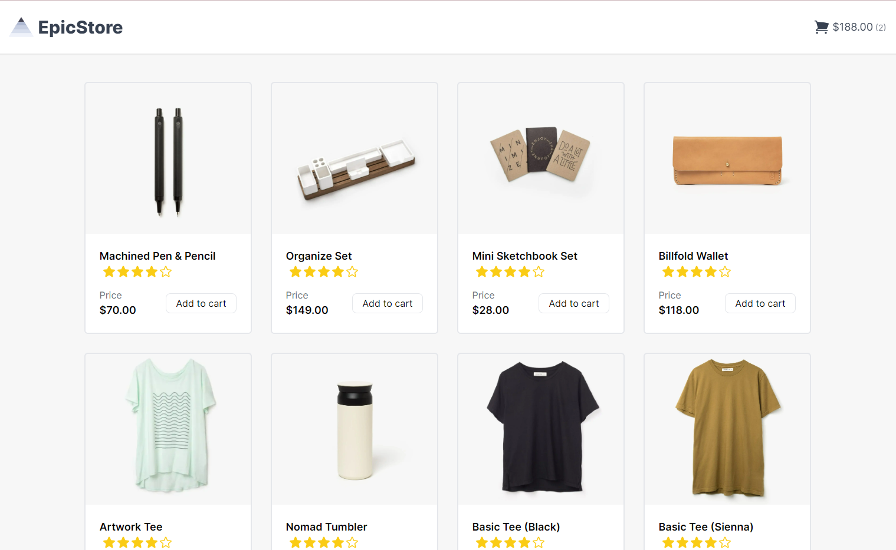
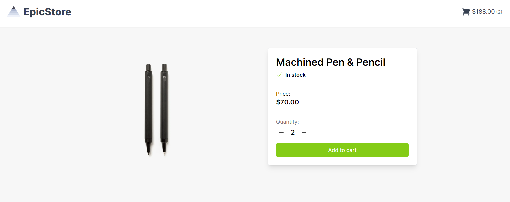
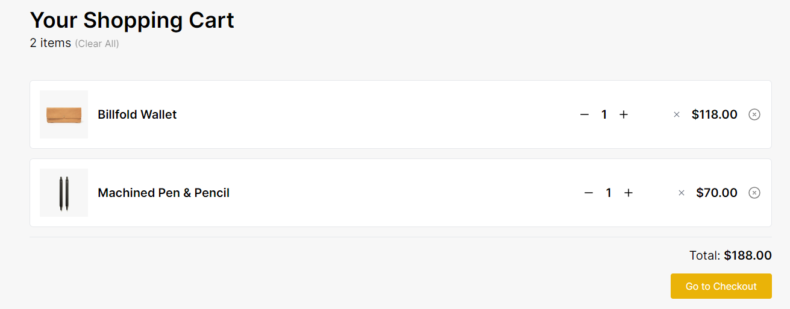
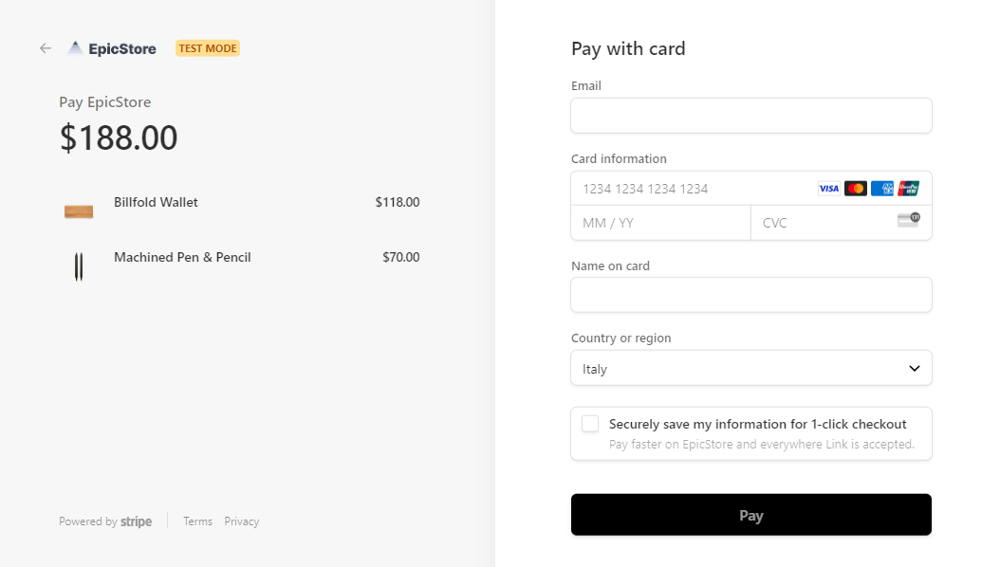

# 🛍️ Full Stack E-Commerce Website using Next.js, Tailwind CSS, Stripe

Welcome to my awesome Full Stack E-Commerce project built using Next.js, Tailwind CSS, Stripe, and the use-shopping-cart APIs! This project allows users to browse through a variety of products, add items to their cart, and seamlessly proceed to payment using the power of Stripe. 🎉
I deployed the project on Vercel -> 

## 🛒 Features
- Browse through a wide range of amazing products.
- Add items to your cart and watch the cart update in real-time using use-shopping-cart APIs.
- Easily remove items from your cart with just a click.
- Seamless payment processing powered by Stripe integration.

## 🛠️ Technologies Used
- Next.js
- Tailwind CSS
- Stripe
- Axios

## 📞 Contact
If you have any questions or suggestions, feel free to reach out to me at diego.boost@gmail.com